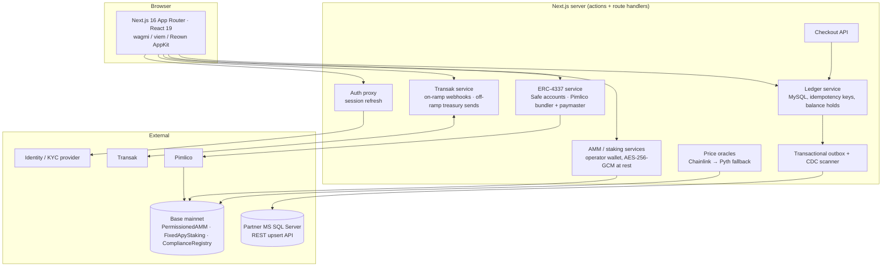

# Compliant Token Exchange

A production **retail token exchange on Base** for users who have never held crypto. It's sign-up-with-email, with no seed phrases and no gas. Under the hood it's a full money-movement stack: ERC-4337 smart accounts, a permissioned AMM, fixed-APY staking, fiat on- and off-ramps, an idempotent double-entry-style ledger, and a transactional outbox that mirrors every business table to a partner's SQL Server.

This is a white-label build of a platform I built end to end (contracts, backend, frontend, ops) for 1,000+ retail users. The smart contracts are in a separate repo: **[compliant-amm-contracts](https://github.com/yasinadil/compliant-amm-contracts)**.

---

## What users can do

| Flow | How it works |
|---|---|
| **Onboard** | Email/password via an upstream identity provider; a Safe smart account is created per user. KYC status (via Didit) maps to on-chain compliance tiers. |
| **Buy with fiat** | Transak on-ramp. Webhooks are verified, deduplicated and credited to the internal ledger, then converted to the platform stablecoin (USDX) or fiat-pegged tokens (EURX, GBPX, BRLX). |
| **Swap** | PLAT ⇄ USDX through the on-chain AMM, either directly from the smart account (gasless, KYC-gated, daily-limited) or custodially via the operator wallet. Quotes include price impact against a trade-size-aware slippage policy. |
| **Earn** | Fixed-APY staking with lock periods and capped monthly emissions; claim and unstake are sponsored too. |
| **Cash out** | Off-ramp to bank via Transak: the treasury wallet sends USDC to the provider's deposit address, and a guided tutorial walks users through the provider's source-of-funds form. |
| **Partner checkout** | A server-to-server **Checkout API** (balance, charges, refunds) for partner merchants, with idempotency keys and an audit log. OpenAPI spec at `/api-docs`. |

## Architecture



### Engineering highlights

- **Gasless ERC-4337 UX.** Safe smart accounts via `permissionless`, Pimlico bundler and verifying paymaster, and a **sponsorship webhook** (`/api/webhooks/pimlico-sponsor`) that sponsors UserOperations only for allow-listed smart accounts and fails closed when the list is empty.
- **Money-safe ledger.** Every credit and debit is an idempotent ledger transaction (unique `idempotency_key` on ledger, trade and cash-out rows), with balance holds for in-flight orders and deferred trade statuses for multi-leg flows (swap, then optional fiat-token conversion).
- **Reconciliation.** `/api/cron/reconcile` re-polls Transak for stuck orders and compares chain state against the ledger. `docs/OPS_RUNBOOK.md` covers DB outages, stuck orders, chain-vs-ledger drift and replaying dropped webhooks.
- **Transactional outbox + CDC.** Business writes enqueue sync jobs in the same DB transaction. A worker delivers them to the partner's REST API with capped exponential backoff and full jitter, dead-lettering, a stale-lock reaper, a global sweep lock and retention pruning. A watermark-based CDC scanner mirrors all business tables without instrumenting every write.
- **Keys at rest.** Internal and operator wallet keys are AES-256-GCM encrypted in MySQL, decrypted only in a 60-second in-process cache inside the few files that sign. They are never returned, logged or written to failure columns, and `server-only` imports make a client-side import a build error.
- **Swap security layer.** Burst rate limits, per-user daily limits (DB-configurable, cached), admin approvals for large trades, and KYC tier checks before any operator-side swap.
- **Oracles.** Chainlink FX feeds on Base with automatic Pyth (Hermes) fallback, with the price source recorded per order.
- **Ops surface.** Admin panel for AMM parameters, liquidity planning (a constant-product simulator), the operator wallet, user tiers and transaction review. Health endpoint, Docker image, OpenAPI docs.

## Tech stack

Next.js 16 (App Router, server actions) · React 19 · TypeScript · Tailwind CSS · wagmi 3 / viem 2 · Reown AppKit · permissionless (ERC-4337, Safe) · Pimlico · ethers 6 · MySQL 8 / Azure Flexible Server (`mysql2`) · Transak · Chainlink / Pyth · Docker · Swagger UI

## Repository layout

```
app/
  actions/        server actions: auth, swap, amm, staking, onramp, cashout, kyc, wallet, gasless, sync-outbox
  api/            route handlers: checkout API, webhooks (Transak, Pimlico), cron (reconcile, sync-outbox), health, openapi
  lib/            services: ledger, trade orders, wallets, AMM, staking, oracles, Transak, Pimlico, outbox/CDC, security
components/       Exchange, Staking, Dashboard, admin panels, app shell
config/           contract addresses, ABIs, wagmi / AppKit config
sql/              greenfield schema + 25 numbered migrations (see sql/README.md)
docs/             ops runbook
scripts/          migration runner, sync test harness, key-exposure check
```

## Running locally

```bash
cp .env.example .env.local      # fill in DB, RPC, Pimlico, Transak, identity provider
mysql < sql/schema_init_greenfield.sql
npm install
npm run dev
```

CI runs `tsc --noEmit` on every push. ESLint currently reports pre-existing React-compiler rule violations (`react-hooks/set-state-in-effect`), so it isn't a CI gate yet.
